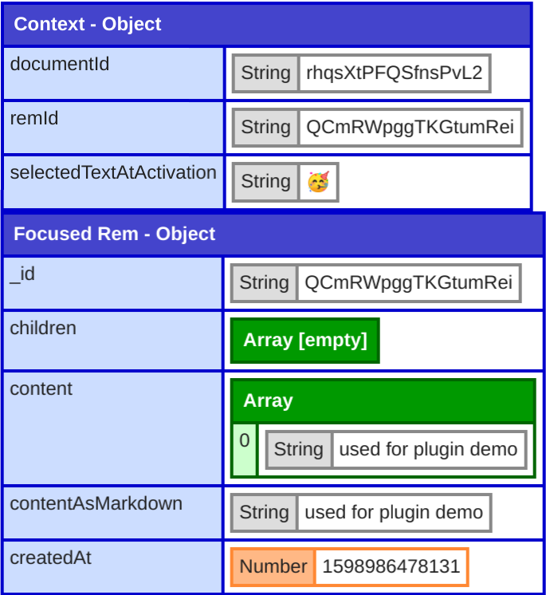

# RemNote-Schedule

Inspect the current Rem.



## Installation

Add this URL to your [RemNote plugins](https://www.remnote.io/plugins):

- **Plugin Name:** `inspect` (or anything you like)
- **Plugin Description:** `Inspect current Rem` (or anything you like)
- **Plugin URL:** `https://hannesfrank.github.io/remnote-inspect/index.html`
- **CSS Height:** `600px`
- **CSS Width:** `600px`
- **Permissions:** `Read`
- **Shortcut:** (anything you like)
- **Location:** `Popup`

## Usage

- Press the shortcut in any Rem.
- You can click on labels to fold them.
- Use `Esc` to close the popup.

Everything is also printed to the `console`.

## Development

Add a plugin `inspect-dev` with the above settings.

```
http://localhost:1234/
```

Run the plugin locally:

```
yarn dev
```

### Deployment

```sh
yarn deloy
```

## Roadmap

- Click on rem ids to further explore the tree
  - This might be easier with `prettyprint` than `nodedump`
- Custom transforms
  - Timestamp to datetime
  - Show name of rem in addition to id

## About RemNote's datastructures

- `name`: rem text before `::`
- `content`: rem text after `::`

`name` and `content` are list of strings and rich text elements. There are the following types:

```js
{
  ANNOTATION: 'n',
  AUDIO: 'a',
  CODE: 'o',
  DRAWING: 'r',
  GLOBAL_NAME: 'g',
  IMAGE: 'i',
  PLUGIN: 'p',
  REM: 'q', // Rem Reference
  TEXT: 'm'
}
```

In case of `m` (`TEXT`), a one of the following keys is set to `true` to indicate a type of formatting:

```js
{
  BOLD: "b",
  CLOZE: "cId",
  HIDDEN_CLOZE: "hiddenCloze",
  HIGHLIGHT: "h",
  ITALIC: "l",
  LATEX: "x",
  LINK: "url",
  QUOTE: "q",
  REVEALED_CLOZE: "revealedCloze",
  UNDERLINE: "u",
}
```
